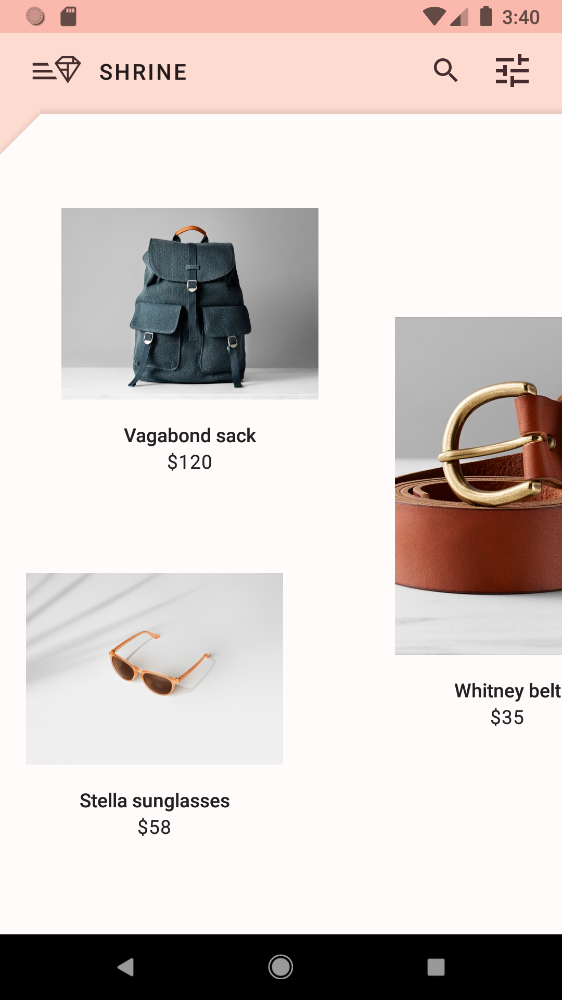

# Project created on Material Components for Android (Kotlin)

This project has taught me how to use material design components in android app
These are the screenshots from the app current version

